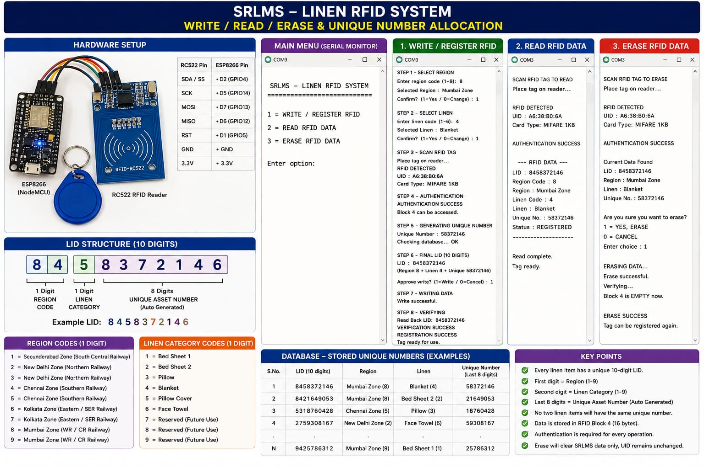
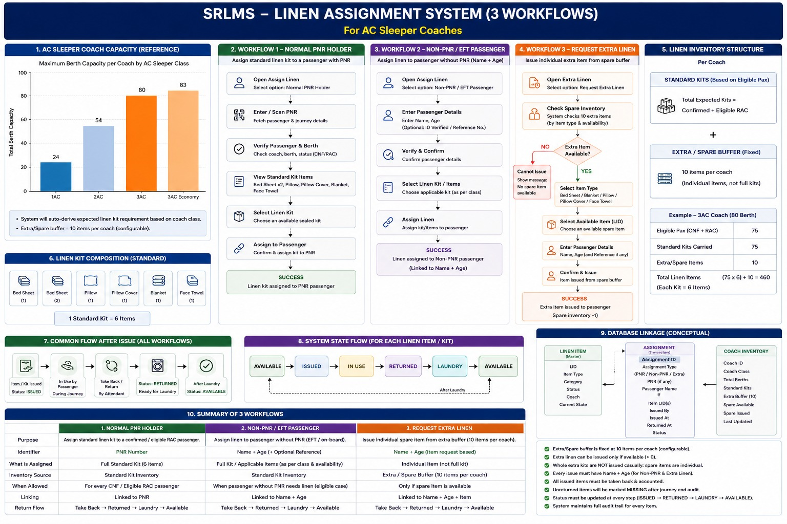
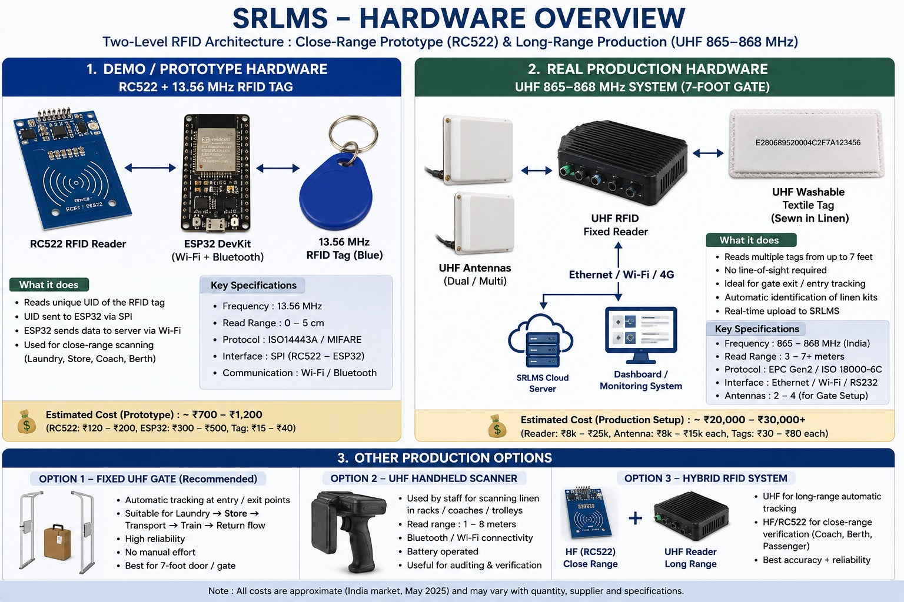
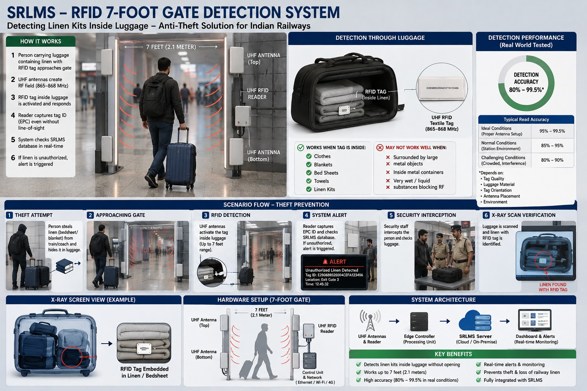

# SRLMS — Smart Railway Linen Management System

RFID-based tracking for railway linen (bed sheets, blankets, pillows, pillow
covers, towels) across the full lifecycle: **register → assign to a
passenger's PNR → use → return → laundry → exit-gate anti-theft
detection → blacklist enforcement.**

SRLMS is built in two parts that plug into each other:

- **Hardware** — an RFID reader/writer that stamps every linen item with a
  unique 10-digit tag ID (LID), and (in production) a long-range UHF gate
  system that can detect linen hidden inside luggage as a passenger exits.
- **Software** — a role-based web app (coach attendant / linen contractor /
  railway officer / passenger) that turns those tag IDs into an actual
  assignment, return, and theft-detection workflow tied to a passenger's
  PNR.

This repo contains the firmware for the hardware side and the full-stack
MVP for the software side, plus the reference diagrams and demo videos
below.

---

## Demo videos

| Video | Covers |
|---|---|
| [Phase 1 — Software walkthrough](https://youtu.be/mjcnY59cm1c) | The end-to-end software flow: PNR lookup, linen assignment, kit registration, gate-alert simulation. |
| [Hardware — how an RFID tag gets its unique number](https://www.youtube.com/watch?v=GXQk6SBdLHM) | The ESP8266 + RC522 prototype writing a fresh LID to a blank tag over Serial. |

---

## 1. How a linen item gets its unique ID (hardware)

Every physical linen item is tagged with a 13.56 MHz MIFARE RFID tag. An
ESP8266 + RC522 reader/writer (firmware in [`hardware/`](hardware/))
generates and writes a **10-digit LID** to the tag:

```
[1-digit region][1-digit linen type][8-digit unique number]
Example: 8 4 58372146  →  8 = Mumbai, 4 = Blanket, 58372146 = unique asset number
```

The Serial-Monitor menu supports **Write/Register**, **Read**, and
**Erase**, with authentication, duplicate-number checking (via an on-board
EEPROM database), and a read-back verification step on every write — see
[`hardware/README.md`](hardware/README.md) for the full flow, wiring
diagram, and bill of materials.

<p align="center">
  
</p>

---

## 2. How linen reaches a passenger (software workflow)

Once tags exist, the software assigns them to passengers under three
workflows, sized against real AC-sleeper coach capacity:

- **Normal PNR holder** — scan/enter PNR → verify passenger & berth → view
  the standard 6-item kit (2 bed sheets, 1 pillow, 1 pillow cover, 1
  blanket, 1 face towel) → assign.
- **Non-PNR / EFT passenger** — no PNR available, so the passenger is
  identified by name + age instead, and linen is assigned the same way.
- **Request extra linen** — issue a single spare item (from a fixed
  10-items-per-coach buffer) against a name + age, separate from the
  standard kits.

Every item then moves through a single state machine —
`AVAILABLE → ISSUED → IN USE → RETURNED → LAUNDRY → AVAILABLE` — with a
full audit trail on every transition.

<p align="center">
  
</p>

---

## 3. Hardware architecture: prototype vs. production

The RC522 setup above is deliberately a **short-range bench prototype**
(0–5 cm read range) used to prove out the numbering/write/read/erase
logic cheaply. The intended production system swaps this for **UHF
(865–868 MHz)** fixed readers with a 3–7 m read range, so a whole coach's
worth of linen can be scanned without touching each item individually.

<p align="center">
  
</p>

| | Demo / Prototype | Production |
|---|---|---|
| Frequency | 13.56 MHz (RC522) | 865–868 MHz (UHF, India band) |
| Read range | 0–5 cm | 3–7+ meters |
| Protocol | ISO14443A / MIFARE | EPC Gen2 / ISO 18000-6C |
| Est. cost | ₹700 – ₹1,200 | ₹20,000 – ₹30,000+ (reader + antennas + tags) |
| Use case | Bench testing, close-range registration | Gate-level detection, laundry/store tracking at scale |

---

## 4. Exit-gate detection & anti-theft workflow

In production, a **7-foot UHF gate** (2–4 antennas) sits at coach/station
exit points. It can detect an RFID-tagged linen item **inside a closed
bag** — no line of sight and no unpacking required.

<p align="center">
  
</p>

**Theft-prevention flow:**

1. A passenger carries luggage containing a linen item past the exit gate.
2. UHF antennas create an RF field across the 7-foot gate and activate the
   tag sewn into the item — even through the bag.
3. The reader captures the tag's EPC ID and checks it against the SRLMS
   database in real time.
4. **If the item's status is still `ISSUED` / `assigned`** (i.e. it was
   never returned/checked out through the proper flow) → the system fires
   an alert: item ID, gate location, timestamp, and the PNR/passenger it's
   linked to.
5. Security staff intercept the passenger and inspect the luggage;
   detection accuracy is 80–99.5% depending on antenna setup and
   environment (see the "Detection Performance" panel above).
6. **The matching PNR is flagged and routed into the blacklist review
   workflow** — a railway officer must **approve** or **reject** the
   flag (nobody is auto-banned on a single alert), and the outcome plus
   every step of the incident is written to an append-only audit log.

The current software repo ships a **gate-scan simulator** standing in for
the physical UHF gate (enter an item's LID + a gate ID and it behaves
exactly like a real reader would) so this whole flow — alert → incident →
blacklist review — can be exercised end-to-end without the physical gate
built yet. Swapping the simulator's endpoint for a real gate webhook later
doesn't require touching the detection/blacklist logic itself.

---

## Repository structure

```
SRLMS/
├── README.md                          ← you are here
├── docs/
│   └── images/                        ← the 4 reference diagrams used above
├── hardware/
│   ├── README.md                      ← wiring, BOM, flashing instructions
│   └── arduino/
│       └── SRLMS_RFID_ESP8266.ino     ← ESP8266 + RC522 firmware (Write/Read/Erase)
└── software/
    └── railway-pnr-mvp/               ← full-stack web app (see its own README)
        ├── backend/                   ← Node.js + Express + MongoDB API
        └── frontend/                  ← React + Vite + Tailwind
```

## Quick start

**Hardware:** see [`hardware/README.md`](hardware/README.md).

**Software:** see
[`software/railway-pnr-mvp/README.md`](software/railway-pnr-mvp/README.md)
for full setup — short version:

```bash
# backend
cd software/railway-pnr-mvp/backend
npm install
npm run seed   # demo admin, attendants, PNRs, linen ops & railway officer logins
npm run dev    # http://localhost:5050

# frontend (new terminal)
cd software/railway-pnr-mvp/frontend
npm install
npm run dev    # http://localhost:5173
```

The software's RFID/LID numbering (`backend/utils/lidGenerator.js`) is
format-identical to what the ESP8266 firmware writes, so demo data and
real hardware tags are interchangeable.

## Roles at a glance

| Role | What they do |
|---|---|
| **Coach attendant** | Sees their coach's manifest, assigns/returns linen against a PNR. |
| **Linen operator** (private laundry contractor) | Registers new RFID items, assembles kits, prints QR labels. |
| **Railway officer** | Read-only oversight: passenger/linen search, incident review, blacklist approve/reject, CSV reports, audit log. |
| **Passenger** | Looks up their own ticket + linen status by PNR, can self-return their kit. |
| **Admin** | Full access across all of the above. |

## Current scope / what's simulated vs. real

- ✅ Real: RFID write/read/erase firmware, LID generation & dedup, PNR ↔
  linen assignment, return flows, state machine, audit logging, blacklist
  review workflow.
- 🔶 Simulated (no physical UHF gate yet): exit-gate scans — the software
  gate-scan endpoint stands in for a real reader and can be swapped for a
  live webhook without changing the detection logic.
- 🔶 Simulated (no camera/scanner yet): QR/RFID "scan" inputs in the web UI
  are manual entry or a "Simulate scan" button, ready to be wired to a
  real scanner.

## License

Add your preferred license here before publishing (e.g. MIT).
